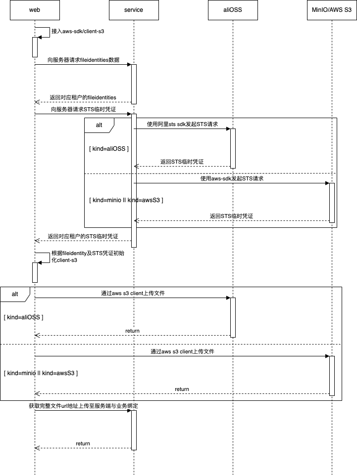
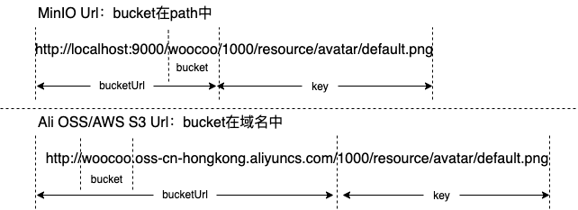
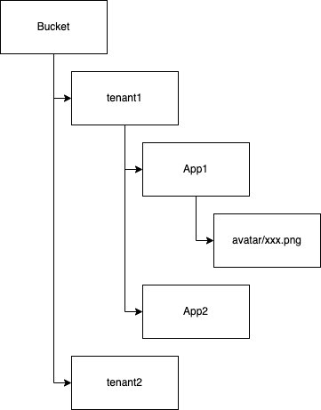

# 文件存储

文件存储采用的是对象存储方案，以兼容市面上的对象存储方案，如阿里云 OSS、MinIO、Amazon S3等。文件存储全部采用对象存储方案，是为了后续运维、迁移、备份、等操作方便考虑，系统可以随时方便快捷的切换对象存储提供商，也包括系统代码的统一性，目前主要使用aws-sdk提供的s3协议进行文件操作，其他特殊的api根据对象存储提供商进行兼容。

## 文件上传

文件的操作采用S3协议，前端统一使用aws-sdk，通过服务端获取STS临时凭证以及OSS所需信息初始化s3 client对文件进行操作。服务端通过OSS提供商的SDK来获取STS临时凭证，统一使用aws-sdk对文件进行操作，具体流程如下：

## 文件访问

为了在业务中对文件的使用进行简化，我们约定在业务表中只存储文件的url，由于url在大部分业务中都是私有链接，需使用OSS的签名URL，以前端访问url为例，具体步骤如下：

- 获取文件url，url用于解析OSS访问文件所需的key及bucket。
- 如果能确定当前使用的fileidentity，则通过fileidentity直接取bucket name。如果不能确定，则通过fileidentity中的bucketUrl来左匹配url，取出匹配到的fileidentity来获取bucket name。
- 根据fileidentity判断当前使用的OSS，如果是MinIO（由于MinIO的path包含bucket name），则解析url的path并删除path前缀中的bucket name，这样就得到bucket中的的相对路径key。如果不是MinIO，则直接解析url的path路径即为key。
- 根据获取的fileidentity初始化s3 client，通过s3 client获取签名URL供访问。

url图解示例如下：

## 文件存储路径

为了方便管理，存储路径按照约定处理，如：bucket/teaantID/appCode/xxx/xxx.png，具体Bucket下存储结构如下：

在系统设计中，同一租户没有限制文件存储的Bucket，一般来说一个租户只会存储在一个Bucket或者多个租户存储在同一个Bucket下，方便后续管理。当然，如果有特殊需求，也支持一个租户的文件存储在多个Bucket下，通过特别指定一些参数来指定存储的Bucket。

