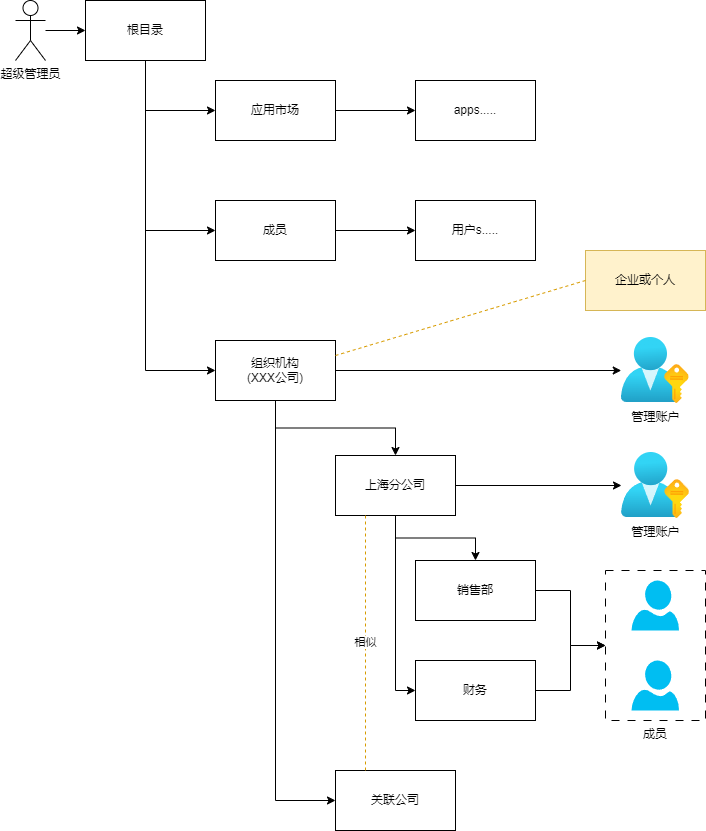

# 目录

目录是企业可管理的资源的总目录结构,这点和活动目录(Active Directory)的管理方式是类似的,但类型更为少,不同资源的管理有不同的复杂度,分为几类型：

- 组织机构（Organization）: 企业的组织结构。
- 软件应用（Appliation）: 企业采购的软件或者某一子系统，而钉钉上的应用即可视为一种资源。

对于每一个注册账户,当需要企业级管理需求时,需要创建目录结构.将产生树型结构的目录树。对于不同的节点有不同的类型来标识不同的资源

:::note
在Knockout中，没有针对目录的对象结构，而是通过`Org`实体来管理目录，类型为`root`的即为顶级目录。
现有节点类型：
| 名称 | 描述 |
| --- | --- |
| root | 目录根节点 |
| organization | 组织机构 |
:::

目录结构的产生只要有以下两种情况：

- 组织注册；
- 用户升级为租户，此时可看到用户也默认产生自身为主负责人的组织；

目录示例:

## 组织机构资源

对于企业，组织机构资源是组织架构的描述,如企业组织架构,部门组织架构,岗位组织架构等。

## App 资源

应用资源是企业资源分配的重要场景. 主要包括基本信息,功能菜单,操作等信息

如 A 企业有上海,厦门分公司.需要采购 WMS 来管理物流仓储业务,在企业组织下该业务是归属上海分公司,厦门分公司不涉及.

要区分上海分公司与 WMS App 的关系有如下方式

1. App 资源显示分配给上海分公司.
2. App 资源定义角色,将角色分配与上海分公司员工,即代表应用的分配

第二种方式需要有较高级别的权限才可做到,不利于分权管理.因此采用第一种显示方式处理.

在各企业会创建私有 App 资源,但未来仍然后有公开的可能性,因此即使是私有 App 资源,也会统一归入应用管理中,需要符合应用管理要求,如有唯一的标识等.

### 应用角色

为了方便最终用户管理权限，应用自身可根据业务场景及流程预定义好角色，终端用户可直接引用这些角色，方便快速完成账号的授权。

### 应用资源

应用资源代表着应用的组成，其中我们重点关注和访问控制有关的资源,如:

- 行动: 如 API 接口,用于是否具有该操作的权限,
- 数据: 常见的就是文件,数据库数据等.

对于接口和数据都可以使用 URI 格式来表达. 由于接口代表着操作,与数据有较明显的区别,因此我们在元数据中,也是将接口和数据这两种资源也是分开定义的.

#### 行动(Action)

权限控制中行动要素指的是主体（Subject）对客体（Object）的操作，例如读取、写入、删除等。

每个应用在上线前应该规划应用内的Action，针对不同的接口形式，在Knockout中建议如下：

- Restful: 路径形式，如 /api/v1/users
- GraphQL: 查询或变更名称，如 query、mutation中的动作名称，如 viewUser、createUser、updateUser、deleteUser

> 目前主要是基于HTTP协议的，后续补充RPC协议。

#### 数据资源(Resource)

文件类的可自然的处理 URI 格式如: /dir/subdir/fileName

而类似数据库的数据,我们一般选择主数据做为权限控制入口,对于数据库我们可知通过数据库->数据表->主键即可定位到具体的一行数据.数据库及数据表可合并为数据类型(DataType)

这样可定义应用资源名称(ARN):`{应用名称}:{账户 ID}:{资源名称}:{计算表达式(字段/字段值表达式)}`,类似如下例子:

| 应用名称 | 账户 ID | URI                        | ARN                                          |
| -------- | ------- | -------------------------- | -------------------------------------------- |
| 文件应用 | 1000    | /root/document/desktop.png | file:1000:/root/document/desktop.png         |
| 订单应用 | 1000    | order/202201010001         | ord:1000:order:order_id/202201010001         |
| 订单应用 | 1000    | order 日期大于 2023.01.01  | ord:1000:order:order_date/>2023.01.01:kind/1 |

> 目前支持的操作符: =(默认不写)

### 策略

应用中的策略资源是在访问管理的基础上内置的规则，请参考[访问管理](./access-control.md)。